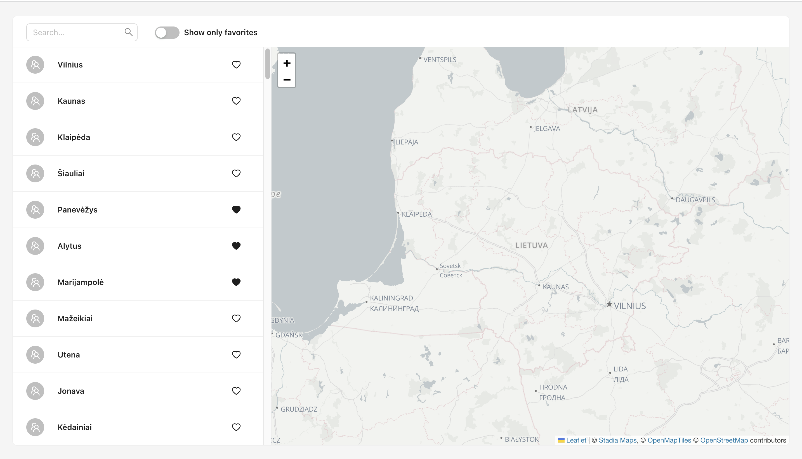

# Test Cities App



## Available Scripts

In the project directory, you can run:

### `yarn start`

Runs the app in the development mode.

Open [http://localhost:3000](http://localhost:3000) to view it in the browser.

The page will reload if you make edits.

You will also see any lint errors in the console.


### `yarn start:server`

Launches json-server on port 8080.

Available GET POST DELETE endpoints:

http://localhost:8080/cities

http://localhost:8080/favorite-cities-ids


### `yarn start:all`

Runs both scripts mentioned above.

## About this application

This UI displays a list of Lithuanian cities and a map of Lithuania. By clicking on a city in the list, the map zooms in on the location of the city. You can also see that there is a search input and a heart icon button. Hear button icon indicates if city is Favorites list - the city is Favorite if the icon is filled. Search input should filter cities list by city name.

## Tasks

0. Create new branch from master. Name the branch {your-name}-task. Commit each task solution separetely in the branch. When you complete all the tasks, push your branch to the repository.

1. Make the background color of the city icon in the city list dynamic based on the city's population. The icon color is currently grey.

    1. If city population is more than 250 000 background color should be green.

    2. If city population is is more than 20 000 but less than or equals 250 000 background color should be orange.

    3. If city population less than or equals 20 000 background color should be pink.

2. Implement "show only favorite cities" functionality. Use existing switch element. When switch is active the list should contain only favorite cities.

3. Implement search city functionality. Use existing search input element.

4. Implement add/remove favorite city. For making requests use RTK Query. RTK Query instance is already setup in src/api.ts file. There are 2 queries already: "useGetAllCitiesQuery", "useGetFavoriteCitiesIdsQuery".

    1. When user press on outlined heart icon button - the city should be saved as favorite and the icon must be filled.

    "Add favorite" request example:

    ```
    POST http://localhost:8080/favorite-cities-ids
    body: {
    id:1
    }
    ```


    2. When user press on filled heart icon - the confirm popup should appear. If users confirms - the city should be removed from favorites and the icon must be outlined.

    "Remove favorite" request example:

    ```
    DELETE http://localhost:8080/favorite-cities-ids/1
    ```
